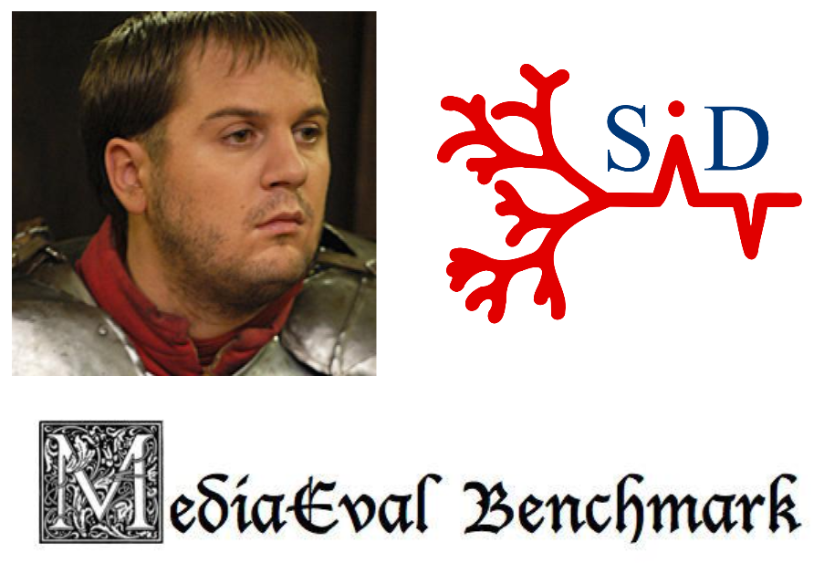

# Karadoc :hamburger:

:movie_camera: :sound: :page_facing_up: TOOL USED TO TAG SOME VIDEOS OF MEDIAEVAL CHALLENGE

<p align="center">
  <a href="https://travis-ci.org/cmisid/Karadoc">
    
  </a>
</p>

<p align="center">
	
</p>

# Installation

## Updating to the latest version of Anaconda

1. Install the release version of [`Anaconda`](https://www.continuum.io/downloads).
2. Follow the instructions below

Create a new virtual environment:
```
conda create -n karadoc python=3
```
Then, launch it with:
```
# Linux and Mac OS X
source activate karadoc
# Windows
activate karadoc
```

## Dependencies

Install python dependencies with :
```
pip install -r requirements.txt
```

# Architecture


1. :green_heart: : **Module de preprocessing**. On extrait des jeux de données plusieurs matrices contenant des features.
2. :yellow_heart: : **Module d'apprentissage**. A partir des matrices de features, on entraîne des classifieurs qu'on sauvegarde par la suite.
3. :blue_heart: **Module de classification**. On peut classifier des nouveaux documents en utilisant le module de preprocessing puis en utilisant les classifieurs sauvegardés.

